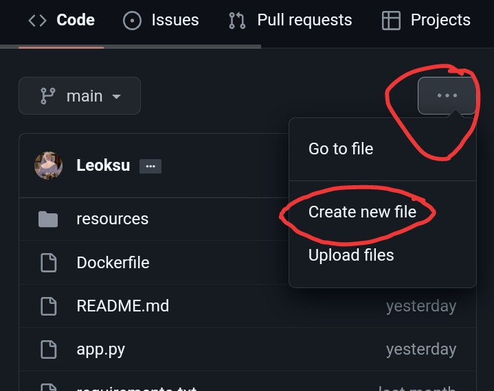

<b><h3>An Script to deploy ultroid on mogenius.com</h3></b>

### Tutorial

- First, you need to clone [Ultroid](https://github.com/TeamUltroid/Ultroid) **(set it private)** and create `.env` file with filled vars

How to create new file

- In your cloned repo
  - View code 
  - Click 3 dots 
  - Select create new files

---
- Go to [GithubToken](https://github.com/settings/tokens) and create new access token (give all permission)
- Clone this repo and set it private
- Open the clone of this repo and edit `app.py` like the existing examples
- And then open [mogenius](mogenius.com) create new accounts and add cloudspace
- Then add service and select docker file
- Connect your GitHub account, select repository the clone of this repo
- Slide cpu, ram, disk to maximum

Detail pic

---
- Add port `8080` and run it
- Congratulations, you are done!

<h3>How to clone?</h3>

- **if you in mobile, turn on desktop site** 
  - click plus sign besides your profile icon and select import repository
  - then fill the old repository column with repo link that you wanna clone
  - **SET YOUR CLONE REPO TO PRIVATE**

---
### Need help?
- Feel free to ask me when you get problem  

### Credits
- This is a modified script for deploy ultroid
- There is [Original](https://github.com/ITZ-ZAID/mogenius) code
- if u use this script, please give both a star ;)
