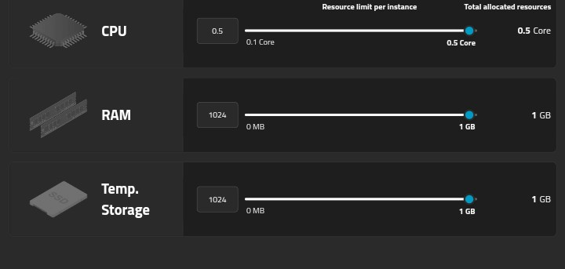

<b><h3>An Script to deploy ultroid on mogenius.com</h3></b>

# Tutorial

1. Star this repo xd
2. Clone this repo and set it private

How to clone manually?

- Simply click this [link](https://github.com/Leoksu/mogenius-ultroid)
- Enter any repository name you want
- :warning: **SET YOUR CLONE REPO TO PRIVATE** :warning:

---
3. Open the clone of this repo and edit `.env` file with your variables
4. And then open [mogenius](https://mogenius.com/) create new accounts and add cloudspace
5. Then add service and select docker file
6. Connect your GitHub account, select repository, add the clone of this repository 
7. Slide cpu, ram, disk to maximum

Detail pic

---
8. Add port `8080` and run it, wait till the deployment complete
- Congratulations, you are done!

# Need help?
- Feel free to ask me when you get problem  

# Credits
- This is a modified script for deploy ultroid
- There is [Original](https://github.com/ITZ-ZAID/mogenius) code
- If this script help you, don't forget give star 
> star it bitjh
